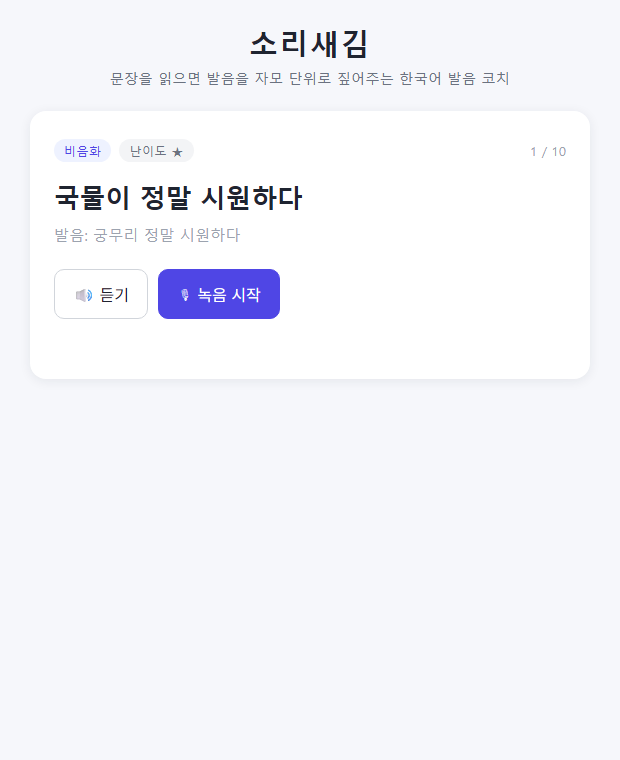
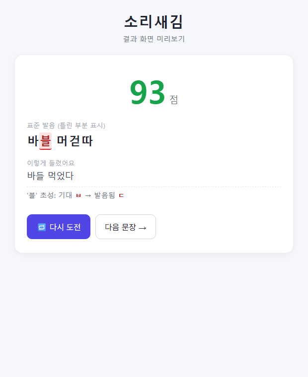
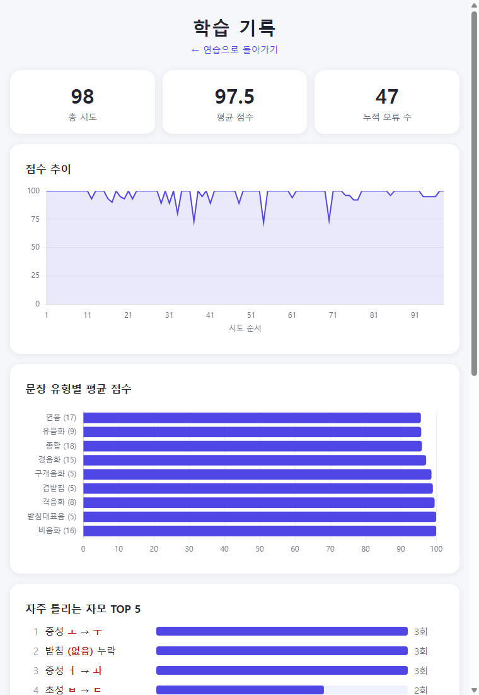

# 소리새김 — 한국어 발음 코치

> **문장을 읽으면 STT로 발음을 인식해 자모(초성·중성·종성) 단위로 점수화하고,
> 어디가 어떻게 틀렸는지 짚어주는 웹 서비스.**
> 8주 1인 사이드 프로젝트(+ 후속 ML 고도화) · Python / FastAPI / Whisper / g2pk / scikit-learn /
> **wav2vec2 fine-tuning (HuggingFace)**

> **후속 성과 (fine-tuning)**: 실데이터로 원래 가정("받침 감지율 35%가 최약점")을 반증하고
> 진짜 병목(정발음 오탐 52%, 83%가 Whisper 오인식)을 찾아, Whisper를 **wav2vec2 발음형 인식기로
> 교체(AI Hub phones 2만 건 미세조정)** — **정발음 오탐 52% → 6%**. (아래 "기술 하이라이트 4" 참조)

| 연습 화면 | 결과 화면 (자모 하이라이트) | 학습 기록 |
|---|---|---|
|  |  |  |

## 무엇이 다른가

기존 발음 평가 서비스는 문장 전체의 합/불만 알려준다. 소리새김은 **"받침 ㅂ이 ㄷ으로
발음됐다"** 수준까지 특정한다 — "밥을 먹었다"를 [받을 머걷따]로 읽으면, 정답 발음형
"바블 머걷따"와 자모 단위로 정렬해 `블`의 초성 오류를 하이라이트하고 툴팁으로 보여준다.

핵심 루프: **문장 제시 → TTS 표준 발음 듣기 → 브라우저 녹음 → Whisper 인식 →
자모 비교 엔진 → 점수 + 오류 하이라이트 → 취약 발음 기반 다음 문장 추천(ML)**

## 아키텍처

```
[브라우저]
  녹음(MediaRecorder) ──webm──▶ [FastAPI  app/]
  점수·하이라이트 ◀──JSON──       ├─ stt/     Whisper small (CPU 문장당 ~2초)
  TTS 재생 ◀──mp3(캐시)──         ├─ engine/  자모 비교 엔진 ★독립 모듈 (외부 의존성 0)
                                  ├─ tts/     Edge-TTS + 파일 캐싱
                                  ├─ ml/      오류 예측 → 문장 추천 (7주차)
                                  └─ SQLite   sentences(33문장) · attempts(점수·오류 JSON·원본 보관)
```

## 기술 하이라이트 3가지

### 1. 최대 리스크를 1주차에 실험으로 판정 — "Whisper가 틀린 발음을 교정해버리면?"

이 프로젝트의 성립 조건은 "STT가 틀린 발음을 틀린 대로 전사하는가"였다.
정상 발음 10문장 + 의도적 오발음 10문장을 직접 녹음해 실험한 결과:

| 오류 유형 | 결과 | 결정 |
|---|---|---|
| 자모 대체형 (받을→바들, 갇이→가디) | **4/7 보존** — 단 표기가 아닌 **발음형 공간**에서 비교해야 잡힘 | Whisper small 유지 |
| 발음규칙 미적용형 (국물을 [국물]로 또박또박) | **0/3** — 표기가 같아져 텍스트로는 원리적 감지 불가 (**표기 수렴 문제**) | 음소 인식(wav2vec2) 경로 검증 추가 |

이 실험이 "표기끼리 비교"라는 최초 설계를 "발음형 공간 비교 + 하이브리드"로 바꿨다.
상세: [experiments/whisper_교정실험.md](experiments/whisper_교정실험.md)

### 2. 자모 비교 엔진 — 순수 Python 독립 모듈

- 한글 음절을 유니코드 산술로 초/중/종성 분해 (빈 종성도 명시 토큰 → 정렬 안정)
- 편집거리 역추적으로 삽입/삭제/대체를 자모 단위 산출, 점수(0~100) + 오류 리포트 dict
- **비교는 항상 발음형(g2pk) 공간**: "밥을"≡"바블"은 100점
- 단위 테스트가 잡은 설계 결함: 인식 결과에 g2p를 재적용하면 음운 규칙이 되살아나
  오류가 지워진다("국무리"→"궁무리") → Whisper 경로/음소 인식 경로를 파라미터로 분리
- pytest 32케이스 · API 응답이 엔진 dict 그대로라 백엔드와 결합도 0

### 3. 규칙 기반 → ML 전환, 그리고 정직한 실패의 기록

데이터 296건(실사용 98 + **TTS 오발음 주입 합성** 198 — 틀린 텍스트를 TTS로 읽히면
오류 라벨이 정확한 오발음 음성이 나온다)으로 7주차에 ML을 적용했다.

| 지표 | 규칙 기반 | ML | 비고 |
|---|---|---|---|
| 연습 문장 추천 precision@5 | 0.40 | **0.60** | 기저율 0.394, out-of-fold 평가 |
| 오류 발생 예측 AUC | — | 0.652 | user 98건 5-fold CV |

- **부정적 결과도 기록**: 최초 설계 "합성으로 학습→실사용 평가"는 실패 — 합성 오류는
  무작위 주입이라 문장 특징과 독립, 학습 신호가 없다. 합성의 올바른 역할은
  **감지율 분석**이었다: 주입 오류의 시스템 감지율 초성 67% / 중성 63% / **받침 35%**
  — 1주차 표기 수렴 문제의 정량화이자 다음 단계(wav2vec2 받침 조준 검사)의 근거.
- 상세: [docs/ml_report.md](docs/ml_report.md)

### 4. (후속) Whisper → wav2vec2 발음형 인식기 교체로 오탐 52%→6%

후속 ML 고도화에서 위 3번의 "받침 35%" 가정을 **실데이터로 반증**했다. AI Hub 실발화
2만 건으로 측정하니 받침 감지율은 실전 **73%**(합성 35%는 TTS 한계), 진짜 병목은
**정발음 오탐률 52%**였고 그 **83%가 Whisper 오인식**(짧은 L2 발화를 다른 단어로 환각)이었다.

→ 표적을 재정의: Whisper를 **wav2vec2 발음형 자모 인식기**로 교체. AI Hub phones(사람 전사
발음형) 2만 건으로 `kresnik/wav2vec2-large-xlsr-korean`에 CTC 자모 헤드를 미세조정
(화자 단위 분할, 누출 0).

| 지표 | Whisper (before) | wav2vec2 (after) |
|---|---|---|
| 발음형 CER | — | **3.9%** |
| **정발음 오탐률(실질)** | **52%** | **6%** |
| 자모-검출 가능 오류 회수율 | — | **99%** |

- fine-tuning / 데이터셋 구축 / 화자 분리 평가 설계 / 정직한 반증까지 실물 근거로 확보.
- 상세: [docs/ml_report.md](docs/ml_report.md) §0 · [finetune_results.md](experiments/results/finetune_results.md) ·
  [후속계획](docs/후속계획_ML고도화_v1.md)

## 실행 방법 (Windows)

```cmd
:: 0) 사전: Python 3.13+, ffmpeg (winget install Gyan.FFmpeg)
::    g2pk는 MSVC C++ 워크로드 + mecab-ko 필요 — experiments\README.md "g2pk Windows 설치" 참고
python -m venv .venv
.venv\Scripts\python.exe -m pip install -r requirements.txt

:: 1) 서버 실행 (첫 평가 요청 시 Whisper small 모델 자동 다운로드 ~460MB)
.venv\Scripts\uvicorn.exe app.main:app --port 8000
:: 브라우저에서 http://localhost:8000

:: 2) (선택) 추천 모델 학습 — 시도 데이터가 쌓인 뒤
.venv\Scripts\python.exe -m ml.train

:: 테스트
.venv\Scripts\python.exe -m pytest tests -q
```

## 프로젝트 구조

```
engine/        자모 비교 엔진 (독립 모듈 — 재사용 자산)
app/           FastAPI + SQLite  ·  stt/ tts/  Whisper·Edge-TTS 래퍼
ml/            특징 추출·학습·추천(본편) + aihub·dataset·미세조정 노트북(후속)
static/        프론트 (프레임워크 없는 HTML+JS, 화면 2개 + 기록)
experiments/   기술 검증 (교정 실험, wav2vec2, 합성 데이터, AI Hub 인벤토리·감지율·미세조정 평가)
docs/          기획서 · 주차별 계획 · 후속계획 · API 스펙 · ML 리포트 · Colab 가이드 · 주간 로그
tests/         엔진 단위 테스트 (32)
```

## 여정 · 한계 · 다음

- 주차별 상세 기록: [docs/log.md](docs/log.md) — 본편 8주(기술 검증→엔진→백엔드→MVP→
  콘텐츠·에러 처리→기록·데이터 증강→ML→마무리) + **후속 +1~3주**(데이터 정제→AI Hub
  데이터셋 구축·표적 재정의→wav2vec2 미세조정).
- **한계**:
  - 본편 ML 지표는 사용자 1명·98건이라 분산이 크다(추천 p@5 등).
  - 후속: 자모-사전형 비교의 **감지 상한 27%** — 사람이 지각한 분절음 오류의 다수가 자모-표준형
    편집거리로 안 드러난다(비교 패러다임의 한계, 프론트엔드 문제 아님).
  - 배포는 CPU 추론 특성상 데모 영상으로 대체(무료 티어 콜드스타트+지연).
- **다음**: 미세조정 모델을 서비스에 통합(받침 조준 검사) · 음향 단위 세밀 채점으로 감지 상한 돌파 ·
  다중 사용자 · 문장 세트 확장.
